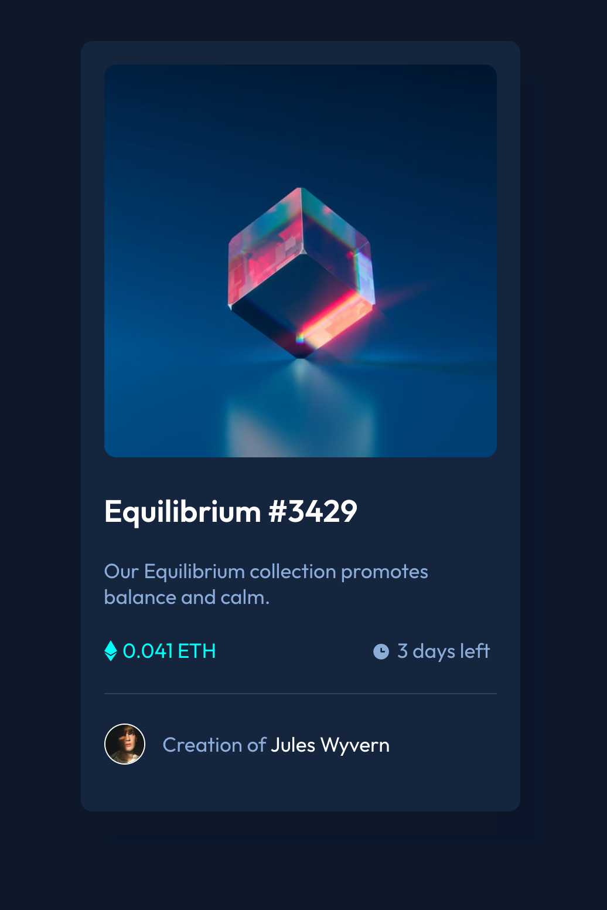
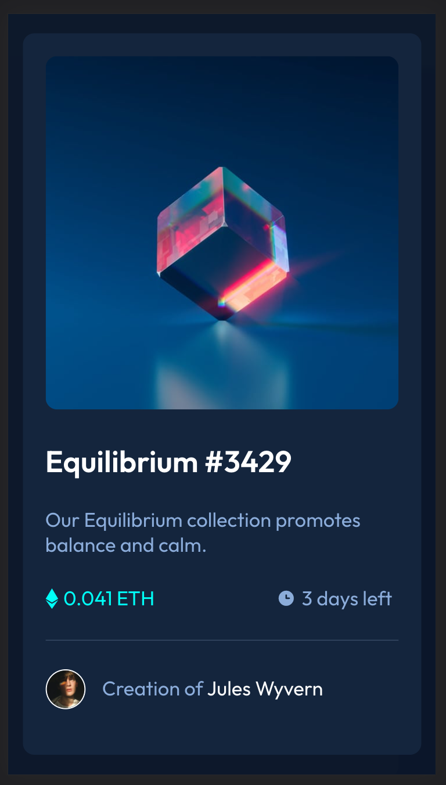
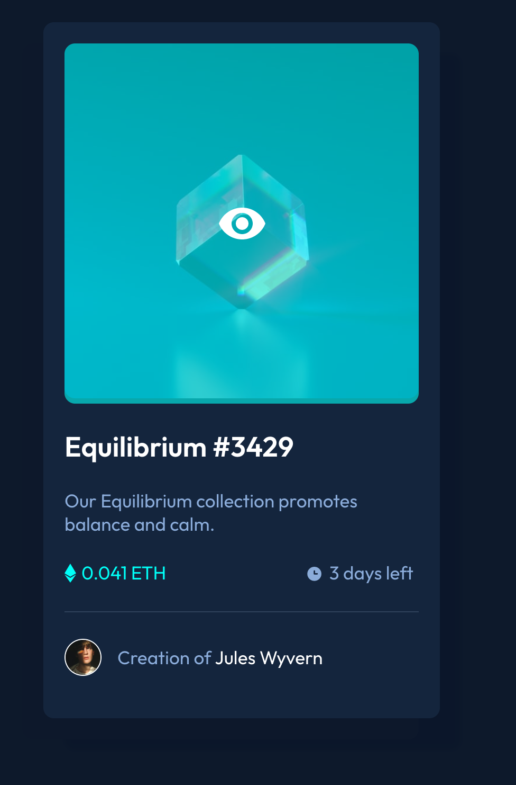

# Frontend Mentor - NFT preview card component solution

This is a solution to the [NFT preview card component challenge on Frontend Mentor](https://www.frontendmentor.io/challenges/nft-preview-card-component-SbdUL_w0U). Frontend Mentor challenges help you improve your coding skills by building realistic projects.

## Table of contents

- [Overview](#overview)
  - [The challenge](#the-challenge)
  - [Screenshot](#screenshot)
  - [Links](#links)
- [My process](#my-process)
  - [Built with](#built-with)
  - [What I learned](#what-i-learned)
  - [Continued development](#continued-development)
  - [Useful resources](#useful-resources)
- [Author](#author)
- [Acknowledgments](#acknowledgments)

**Note: Delete this note and update the table of contents based on what sections you keep.**

## Overview

### The challenge

Users should be able to:

- View the optimal layout depending on their device's screen size
- See hover states for interactive elements

### Screenshot





### Links

- Solution URL: [Add solution URL here](https://your-solution-url.com)
- Live Site URL: [Add live site URL here](https://your-live-site-url.com)

## My process

### Built with

- Semantic HTML5 markup, using BEM
- CSS custom properties
- Flexbox
- Desktop-first workflow

### What I learned

#### Established a workflow

1. Link stylesheet to index file
2. Apply reset css declarations in CSS file
3. Translate style guide into css variables
4. Create html skeleton for the project using BEM
5. Research BEM styling for the structure
6. Use semantic HTML tags wherever possible
7. Add CSS styling starting from the most outer layer to inner layer, from top to bottom
8. Revise HTML if needed

#### Managed a complicated hover state

I learnt how to add a background color to an image on hover with the after pseudo element, and to display an icon on the top of the layered backgrounds - also in hover state.

#### Other

I used reset css properties.
I used css variables for the colors.

```css
:root {
  --soft-blue: hsl(215, 51%, 70%);
  --cyan: hsla(178, 100%, 50%, 1);
  --cyan-opacity: hsla(178, 100%, 50%, 0.6);
  --dark-blue-dark: hsl(217, 54%, 11%);
  --dark-blue-middle: hsl(216, 50%, 16%);
  --dark-blue-light: hsl(215, 32%, 27%);
  --white: hsl(0, 0%, 100%);

  --main-bg-color: var(--dark-blue-dark);
  --secondary-bg-color: var(--dark-blue-light);
  --card-bg-color: var(--dark-blue-middle);
  --primary-highlight-color: var(--cyan);
  --primary-text-color: var(--white);
  --secondary-text-color: var(--soft-blue);
}
```

### Useful resources

- [Custom reset CSS](https://www.joshwcomeau.com/css/custom-css-reset/) - Helped me with reset CSS and to "own" this part of the setup.

- [BEM Cheat sheet](https://9elements.com/bem-cheat-sheet/) - Helped me with naming my css classes

- [Using CSS Custom properties](https://developer.mozilla.org/en-US/docs/Web/CSS/Using_CSS_custom_properties) - Using meaningful CSS variables

## Author

- Website - [Krisztina Kovari](https://www.krisztinakovari.com)
- Frontend Mentor - [@krystonen](https://www.frontendmentor.io/profile/krystonen)
- codepen - [krystonen](https://codepen.io/krystonen/)
- Twitter - [@krystonen](https://www.twitter.com/krystonen)

## Acknowledgments

Thanks frontendmentors for this challenge and motivating me to share something on github!
